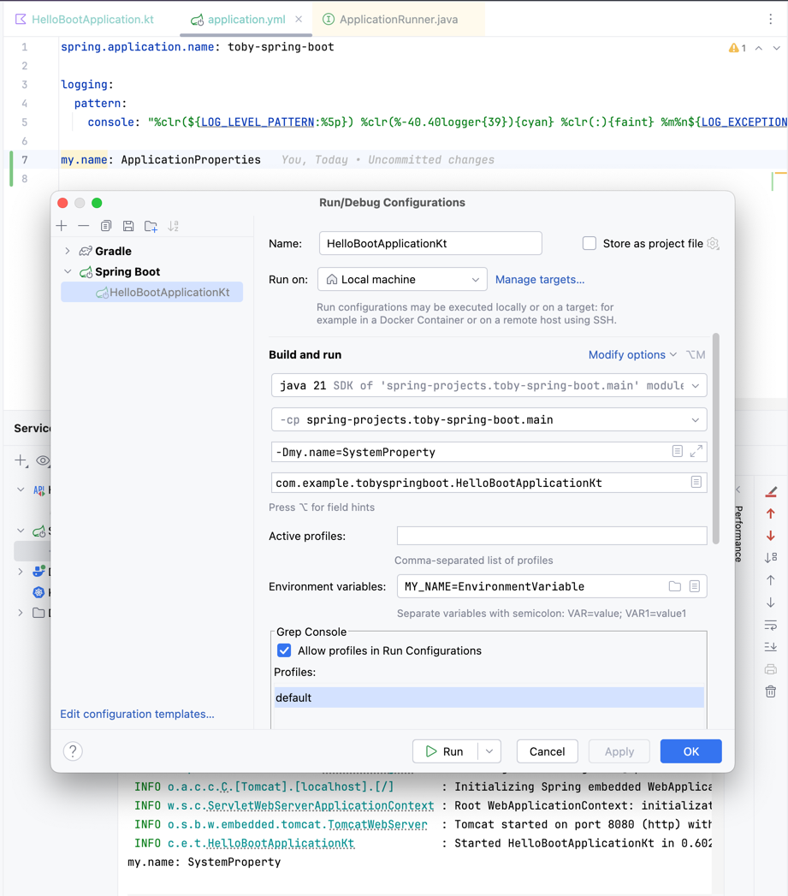

## 07. 자동 구성 기반 애플리케이션

### 인프라 빈 구성 정보의 분리

`@Import`를 이용하면 스캔 대상이 아닌 클래스를 빈으로 등록하도록 추가할 수 있다.
애플리케이션 인프라스트럭처 빈 구성 정보 클래스는 스프링 부트의 자동 구성 메카니즘에 의해서 등록이 되도록 분리하는 작업이 우선 필요하다.
분리된 클래스는 @Import로 포함시킨다.

```kotlin
@Retention(AnnotationRetention.RUNTIME)
@Target(AnnotationTarget.CLASS)
@Import(DispatcherServletConfig::class, TomcatWebServerConfig::class)
annotation class EnableMyAutoConfiguration
```

```kotlin
@Retention(AnnotationRetention.RUNTIME)
@Target(AnnotationTarget.CLASS)
@Configuration
@ComponentScan
@EnableMyAutoConfiguration
annotation class MySpringBootApplication
```

### 자동 구성 애노테이션 적용

`imports` 파일에 있는 클래스들은 `MyAutoConfig` 애노테이션을 부여하지 않았다고 해서 로딩이 안되는 것은 아닙니다.
다만 해당 `MyAutoConfig` 애노테이션을 붙이는 것이 관례입니다.

`proxyBeanMethods=false`

- CGLib를 이용해서 프록시 클래스를 확장을 해서 `@Bean`이 붙은 메소드의 동작 방식을 변경합니다.
- `@Bean` 메소드를 직접 호출해서 다른 빈의 의존 관계를 설정할 때 여러번 호출되더라도 싱글톤 빈처럼 참조할 수 있도록 매번 같은
  오브젝트를 리턴하게 합니다.
- 만약 `@Bean` 메소드 직접 호출로 빈 의존 관계 주입을 하지 않는다면 굳이 복잡한 프록시 생성을 할 필요가 없습니다.
- proxyBeanMethods는 스프링 5.2 버전부터 지원되기 시작했고 지금은 스프링과 스프링 부트에 상당히 많은 @Configuration 클래스 설정에 적용되고 있습니다.
- 이를 @Bean 라이트 모드(lite mode)라고 부릅니다. 빈으 로 등록되는 단순 팩토리 메소드로 사용됩니다.

## 08. 조건부 자동 구성

`org.springframework.boot.autoconfigure.AutoConfiguration.imports`로 AutoConfigure 목록의 빈이 등록됩니다.

### @Conditional과 Condition

```java

@Target({ElementType.TYPE, ElementType.METHOD})
@Retention(RetentionPolicy.RUNTIME)
@Documented
public @interface Conditional {

  Class<? extends Condition>[] value();

}
```

해당 `Conditional` 애노테이션의 경우 `METHOD`와 `TYPE`에 붙을 수 있습니다.

- `@Configuration`의 `Conditional = true`일 때만, `@Bean` 메소드 레벨에서 `Conditional` 비교를 합니다.

### 자동 구성 정보 대체하기

`ImportSelector` 중 `DeferredImportSelector`를 구현해야 하는 이유는 유저 구성 정보가 다 로딩이 되고 나서 자동 구성 정보를
그 다음에 하나씩 하나씩 적용이 되도록 만들기 위함입니다.

### 스프링 부트의 @Conditional

`@ConditionalOnClass` 주로 `@Configuration` 클래스 레벨에서 사용하지만 `@Bean` 메소드에도 적용 가능하다.
단, 클래스 레벨의 검증 없이 @Bean 메소드에만 적용하면 풀필요하게 @Configuration 클래스가 빈으로 등록되기 때문에, 클래스 레벨 사용을 우선해야 한다.

## 09. 외부 설정을 이용한 자동 구성

### 자동 구성에 Environment 프로퍼티 적용

```kotlin
@Bean
fun applicationRunner(env: Environment): ApplicationRunner {
  return ApplicationRunner {
    val name = env.getProperty("my.name")
    println("my.name: $name")
  }
}
```



### @Value와 PropertySourcesPlaceHolderConfigurer

```kotlin
@Value("\${server.servlet.context-path}")
lateinit var contextPath: String
```

Value 애노테이션에 붙은 치환자를 교체해주는 것은 스프링 컨테이너의 기본 동작 방식이 아닙니다.
스프링 컨테이너를 확장해서 치환자가 붙은 필드나 여러가지 구성 정보를 프로퍼티로 교체해주는
그런 후처리 작업을 하는 어떤 기능을 스프링 컨테이너에 추가 해줘야 합니다.


### 프로퍼티 빈의 후처리기 도입


```text
@Component와 같은 애노테이션은 꼭 스캔 등의 기능을 위해서만 붙이는 건 아닙니다.
이 클래스가 스프링의 컴포넌트(빈)이라는 것을 나타내는 주석(annotation)으로 부여할 수도 있습니다.
코드를 읽을 때 ServerProperties를 보고, 이 클래스도 빈으로 등록되고, 다른 빈에 DI될 수도 있구나라고 인식할 수 있습니다.

스프링 @Import의 문서를 보면`Indicates one or more component classes to import — typically @Configuration classes.`
라고 되어있습니다.

여기서 component class가 꼭 @Component가 붙은 클래스라는 의미는 아니지만 스프링의 컴포넌트라고 생각한다면 적절한 애노테이션이 붙어있는게 좋다고 생각합니다.
Import하는 대표적인 컴포넌트인 @Configuration도 @Component를 메타 애노테이션으로 가지고 있는 애노테이션이죠.
```
